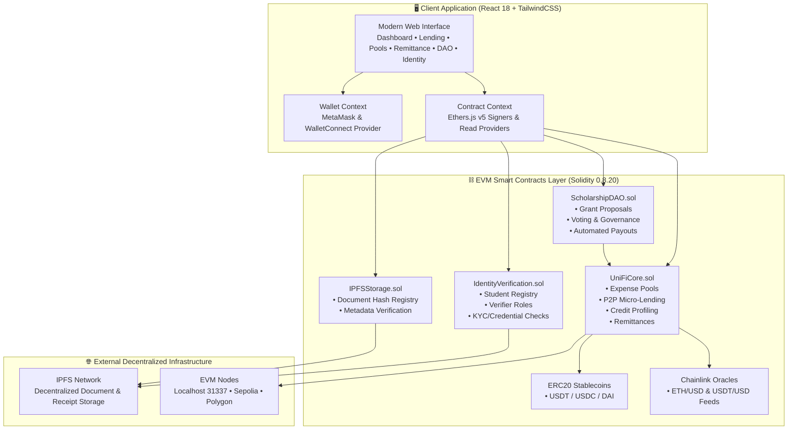

# 🎓 UniFi DeFi Platform

<div align="center">


**A Next-Generation Decentralized Finance Ecosystem Engineered Specifically for University, Hostel, and International Students.**

[](https://soliditylang.org/)
[](https://hardhat.org/)
[](https://reactjs.org/)
[](https://tailwindcss.com/)
[](https://docs.ethers.org/v5/)
[](https://openzeppelin.com/)
[](LICENSE)
[](CONTRIBUTING.md)

[Live Demo](https://Husrocks.github.io/unifi-dapp) • [Smart Contracts](file:///e:/Projects/unifi/contracts) • [Frontend UI](file:///e:/Projects/unifi/frontend) • [Report Bug](https://github.com/Husrocks/unifi-dapp/issues)

</div>

---

## 📖 Table of Contents

- [Executive Summary](#-executive-summary)
- [The Problem vs. The UniFi Solution](#-the-problem-vs-the-unifi-solution)
- [Key Features & Modules](#-key-features--modules)
  - [1. Group Expense Pooling](#1-group-expense-pooling-roommates--projects)
  - [2. Peer-to-Peer Micro-Lending](#2-peer-to-peer-micro-lending)
  - [3. On-Chain Credit Scoring Engine](#3-on-chain-credit-scoring-engine)
  - [4. Low-Fee Cross-Border Remittances](#4-low-fee-cross-border-remittances)
  - [5. Community Scholarship DAO](#5-community-scholarship-dao)
  - [6. Decentralized Student ID & IPFS Storage](#6-decentralized-student-id--ipfs-storage)
- [System Architecture](#-system-architecture)
- [Smart Contracts Directory](#-smart-contracts-directory)
- [Technology Stack](#-technology-stack)
- [Project Directory Structure](#-project-directory-structure)
- [Getting Started](#-getting-started)
  - [Prerequisites](#prerequisites)
  - [Installation](#installation)
  - [Local Blockchain & Contract Deployment](#local-blockchain--contract-deployment)
  - [Frontend Development Server](#frontend-development-server)
- [Environment Configuration](#-environment-configuration)
- [Testing & Quality Assurance](#-testing--quality-assurance)
- [Security Architecture](#-security-architecture)
- [Roadmap](#-roadmap)
- [Contributing](#-contributing)
- [License & Authors](#-license--authors)

---

## 🌟 Executive Summary

Traditional banking infrastructure continually fails university students—especially international students, hostel residents, and young scholars who lack traditional credit histories, endure exorbitant cross-border wire fees, and face opaque bureaucracy. 

**UniFi** is an open-source decentralized finance (DeFi) decentralized application (dApp) built to democratize student financial life. Powered by Ethereum and EVM-compatible networks, UniFi combines **group expense splitting**, **p2p micro-lending**, **reputation-based on-chain credit profiles**, **frictionless stablecoin remittances**, **DAO-managed merit/need scholarships**, and **verifiable decentralized academic credentials** into a unified, responsive interface.

---

## ⚡ The Problem vs. The UniFi Solution

| Challenge Faced by Students | Traditional Banking / Web2 Apps | UniFi Decentralized Platform |
|:----------------------------|:--------------------------------|:-----------------------------|
| **Roommate Bill Splitting** | Chasing payments via Venmo/Splitwise; uncollateralized IOUs | On-chain **Expense Pools** with automated USDT/USDC deposits and release triggers |
| **Emergency Short-term Cash** | Predatory payday loans or credit denial due to no credit history | **P2P Micro-Lending** ($50–$5,000) capped at max 15% APR with fair terms |
| **Credit Scoring** | Non-existent or inaccessible to foreign students | **Dynamic On-Chain Score** increasing with punctual repayments (+10 pts per repayment) |
| **Cross-Border Tuition & Living Costs** | 3–7 business day delays + 5–10% bank wire fees | **Instant Remittance** using stablecoins with near-zero gas overhead |
| **Scholarships & Grants** | Opaque administrative committees, delayed disbursements | **Scholarship DAO** with transparent on-chain proposals and community voting |
| **Student Credentials & Proof** | Fragile paper forms, spoofable PDFs, centralized databases | **IPFS Metadata Indexing** and verifier-attested decentralized identity |

---

## 🚀 Key Features & Modules

### 1. Group Expense Pooling (Roommates & Projects)
- Create targeted expense pools (e.g., apartment rent, shared utilities, hackathons, grocery budgets).
- Dynamic deadline validation and target amount tracking in ERC20 stablecoins (`USDT`/`USDC`).
- Pro-rata contribution and withdrawal logic with safe token transfer guards.

### 2. Peer-to-Peer Micro-Lending
- Direct borrower-to-lender requests with customizable parameters ($50 – $5,000 USDT limit).
- Built-in protocol safety: capped interest rate ($\le 15\%$), future repayment dates, and minimum borrower credit threshold (min. 300 score).
- Instant disbursement on funding; zero intermediaries holding student capital.

### 3. On-Chain Credit Scoring Engine
- Quantitative financial reputation tracked permanently on-chain:
  - Base baseline starting score.
  - **$+10$ points** reward for successful and on-time loan settlements.
  - **$-20$ points** penalty plus default flagging for expired loans.
- Granular tracking of active loans, completed volume, and defaulted events.

### 4. Low-Fee Cross-Border Remittances
- Direct peer-to-peer international value transfers.
- Non-custodial escrow: sender commits funds with recipient address and currency tag; recipient claims funds directly with zero intermediary conversion markup.

### 5. Community Scholarship DAO
- Decentralized Autonomous Organization governing merit- and need-based student grants.
- Democratic governance lifecycle: proposal submission, 7-day voting window, quorum enforcement, and automated fund distribution upon member consensus.

### 6. Decentralized Student ID & IPFS Storage
- Link Ethereum addresses with verified student credentials (Student ID, University, Degree, Expected Graduation Year).
- Distributed document hash indexing via [IPFSStorage.sol](file:///e:/Projects/unifi/contracts/contracts/IPFSStorage.sol) supporting academic transcripts, loan covenants, and receipt proofs.
- Multi-tier role-based verification registry.

---

## 🏛️ System Architecture



---

## 📜 Smart Contracts Directory

All smart contracts reside in [`contracts/contracts/`](file:///e:/Projects/unifi/contracts/contracts) and are compiled with Solidity `0.8.20` featuring OpenZeppelin v5.0 security abstractions:

| Contract | Description | Security Features |
|:---------|:------------|:------------------|
| [`UniFiCore.sol`](file:///e:/Projects/unifi/contracts/contracts/UniFiCore.sol) | Core orchestrator for Expense Pools, P2P Lending, Credit Scoring, and Remittances. | `ReentrancyGuard`, `Ownable`, `SafeERC20`, parameter range checks |
| [`ScholarshipDAO.sol`](file:///e:/Projects/unifi/contracts/contracts/ScholarshipDAO.sol) | Governance module for student grant proposals, membership voting, and fund release. | `ReentrancyGuard`, `onlyMember` role access, quorum threshold |
| [`IdentityVerification.sol`](file:///e:/Projects/unifi/contracts/contracts/IdentityVerification.sol) | Student identity verification registry linking wallet addresses to institutional credentials. | `onlyVerifier` validation, anti-collision student ID indexing |
| [`IPFSStorage.sol`](file:///e:/Projects/unifi/contracts/contracts/IPFSStorage.sol) | On-chain registry pointing to decentralized IPFS content hashes for transcripts and receipts. | Size bounds, type registration, verifiable hash mapping |
| [`MockTokens.sol`](file:///e:/Projects/unifi/contracts/contracts/MockTokens.sol) | ERC20 test tokens (`MockUSDT`, `MockUSDC`, `MockDAI`) with minting utilities for development. | Standard ERC20 with faucet functions |
| [`MockPriceFeed.sol`](file:///e:/Projects/unifi/contracts/contracts/MockPriceFeed.sol) | Chainlink `AggregatorV3Interface` emulator for deterministic testing without external API dependencies. | Static/dynamic mock round answer feeds |

### Deployment Addresses (Localhost / Hardhat Chain ID: 31337)

| Asset / Contract | Local Contract Address |
|:-----------------|:-----------------------|
| **UniFiCore** | `0x0165878A594ca255338adfa4d48449f69242Eb8F` |
| **ScholarshipDAO** | `0xa513E6E4b8f2a923D98304ec87F64353C4D5C853` |
| **IdentityVerification** | `0x2279B7A0a67DB372996a5FaB50D91eAA73d2eBe6` |
| **IPFSStorage** | `0xA51c1fc2f0D1a1b8494Ed1FE312d7C3a78Ed91C0` |
| **Mock USDT** | `0xe7f1725E7734CE288F8367e1Bb143E90bb3F0512` |
| **Mock USDC** | `0x9fE46736679d2D9a65F0992F2272dE9f3c7fa6e0` |
| **Mock DAI** | `0xCf7Ed3AccA5a467e9e704C703E8D87F634fB0Fc9` |
| **Mock ETH/USD Price Feed** | `0xDc64a140Aa3E981100a9becA4E685f962f0cF6C9` |
| **Mock USDT/USD Price Feed** | `0x5FC8d32690cc91D4c39d9d3abcBD16989F875707` |

---

## 💻 Technology Stack

### Blockchain & Smart Contracts
- **Language**: Solidity `0.8.20` (Optimizer enabled: 200 runs)
- **Framework**: [Hardhat](https://hardhat.org/) (`@nomicfoundation/hardhat-toolbox`)
- **Libraries**: [OpenZeppelin Contracts v5.0](https://openzeppelin.com/contracts/) (`ReentrancyGuard`, `Ownable`, `SafeERC20`, `IERC20`)
- **Oracles**: [Chainlink Contracts](https://chain.link/) (`AggregatorV3Interface`)
- **Testing**: Chai, Mocha, Ethers.js v6

### Frontend Application
- **Core**: React 18 (SPA) with React Router v6
- **Web3 Integration**: Ethers.js v5, `@web3-react/core`, `@web3-react/injected-connector`, `@web3-react/walletconnect-connector`
- **State & Caching**: React Context API (`WalletContext`, `ContractContext`), React Query v3
- **Styling & UI**: Tailwind CSS v3.3, Headless UI, Heroicons v2, Framer Motion
- **Analytics & Data Vis**: Recharts (Responsive Line & Donut charts)
- **Feedback & Toasts**: React Hot Toast

---

## 📂 Project Directory Structure

```text
unifi/
├── package.json               # Root workspace scripts & concurrency runners
├── README.md                  # Comprehensive platform documentation
├── contracts/                 # Hardhat blockchain workspace
│   ├── contracts/             # Solidity source files
│   │   ├── UniFiCore.sol             # Main DeFi operations & credit registry
│   │   ├── ScholarshipDAO.sol        # Governance & scholarship treasury
│   │   ├── IdentityVerification.sol  # Student credential verification
│   │   ├── IPFSStorage.sol           # Decentralized metadata registry
│   │   ├── MockTokens.sol            # Test stablecoins (USDT, USDC, DAI)
│   │   └── MockPriceFeed.sol         # Chainlink price aggregator mock
│   ├── scripts/
│   │   └── deploy.js                 # Unified automated deployment & seeding script
│   ├── test/
│   │   └── UniFiCore.test.js         # Comprehensive unit tests for core protocols
│   ├── hardhat.config.js      # Hardhat settings (solc, networks, gas reporter)
│   ├── package.json           # Contract dependencies & scripts
│   ├── env.example            # Contract environment variables template
│   └── deployment-localhost.json # Cached local deployment contract addresses
└── frontend/                  # React dApp workspace
    ├── public/                # Static assets, HTML shell, and manifest
    ├── src/
    │   ├── components/        # Reusable UI elements (WalletButton, LoanCard, etc.)
    │   ├── context/           # WalletContext.js and ContractContext.js
    │   ├── pages/             # Route views (Dashboard, Lending, Scholarships, etc.)
    │   ├── config/            # Network IDs, RPC endpoints, and contract ABIs
    │   ├── App.js             # Route routing & top-level context orchestration
    │   ├── index.css          # Tailwind directives, theme variables, glassmorphism
    │   └── index.js           # React DOM root entry point
    ├── tailwind.config.js     # Tailwind design system tokens & theme configuration
    └── package.json           # Frontend dependencies & deployment scripts
```

---

## ⚡ Getting Started

### Prerequisites
Make sure you have installed on your machine:
- **Node.js**: `v16.x` or `v18.x` or `v20.x` (LTS recommended)
- **npm** (or `yarn`)
- **MetaMask** browser extension installed in your web browser

---

### Installation

Clone the repository and install all dependencies:

```bash
# Clone repository
git clone https://github.com/Husrocks/unifi-dapp.git
cd unifi-dapp

# Option A: Automated installation across all workspaces
npm run install:all

# Option B: Manual installation
npm install
cd contracts && npm install
cd ../frontend && npm install
cd ..
```

---

### Local Blockchain & Contract Deployment

In your terminal, navigate to the `contracts` folder to launch a local Ethereum node and deploy the protocol:

```bash
# Terminal 1: Spin up local Hardhat node (Chain ID: 31337)
cd contracts
npx hardhat node
```

In a second terminal window, compile and deploy the smart contracts onto the local node:

```bash
# Terminal 2: Deploy contracts and mint test tokens
cd contracts
npx hardhat run scripts/deploy.js --network localhost
```

> **Note:** The deployment script automatically deploys mock USDT/USDC/DAI tokens, seeds the deployer account with $10,000 in test stablecoins, sets up price feeds, and generates `deployment-localhost.json`.

---

### Frontend Development Server

With the local node running and contracts deployed, start the React application:

```bash
# Terminal 3: Start React development server
cd frontend
npm start
```

The frontend will start at **[http://localhost:3000/unifi-dapp](http://localhost:3000/unifi-dapp)**.

#### Connecting MetaMask to Local Hardhat:
1. Open MetaMask $\rightarrow$ Select Network dropdown $\rightarrow$ **Add Network manually**.
2. **Network Name**: Hardhat Local
3. **New RPC URL**: `http://127.0.0.1:8545`
4. **Chain ID**: `31337`
5. **Currency Symbol**: `ETH`
6. Import one of the private keys generated by `npx hardhat node` (e.g. Account #0 or #1) into MetaMask to access pre-funded test ETH and stablecoins.

---

## ⚙️ Environment Configuration

### Contracts (`contracts/.env`)
Copy the example file:
```bash
cd contracts
cp env.example .env
```
Key variables:
```env
SEPOLIA_RPC_URL=https://sepolia.infura.io/v3/YOUR_INFURA_KEY
POLYGON_RPC_URL=https://polygon-rpc.com
PRIVATE_KEY=your_wallet_private_key_here
ETHERSCAN_API_KEY=your_etherscan_api_key
REPORT_GAS=true
```

### Frontend (`frontend/.env`)
Create `frontend/.env` to configure external RPCs:
```env
REACT_APP_MAINNET_RPC_URL=https://eth-mainnet.alchemyapi.io/v2/your-api-key
REACT_APP_POLYGON_RPC_URL=https://polygon-rpc.com
REACT_APP_SEPOLIA_RPC_URL=https://sepolia.infura.io/v3/your-api-key
```

---

## 🧪 Testing & Quality Assurance

### Smart Contract Unit Testing
The contract suite includes comprehensive test coverage for pool creation, contribution calculation, loan fulfillment, and credit score recalculations:

```bash
cd contracts
npx hardhat test
```

To run tests with gas estimation reports:
```bash
REPORT_GAS=true npx hardhat test
```

### Frontend Component Testing
Run the React Jest test suite:
```bash
cd frontend
npm test
```

---

## 🛡️ Security Architecture

The UniFi smart contract architecture adheres to strict security standards:

1. **Reentrancy Protection**: Critical state-modifying functions that handle external ERC20 transfers leverage OpenZeppelin's `ReentrancyGuard` with the `nonReentrant` modifier.
2. **Safe ERC20 Operations**: All token interactions utilize `SafeERC20` (`safeTransfer`, `safeTransferFrom`) to guard against non-standard ERC20 token implementations (e.g., missing return booleans).
3. **Controlled Administrative Privileges**: Critical system operations utilize `Ownable` access controls with explicit event logging.
4. **Economic Guardrails**:
   - Loan caps enforced between `50 USDT` and `5,000 USDT`.
   - Interest rate hard-capped at $\le 15\%$ APR to prevent predatory lending.
   - Strict deadline verification on both expense pools and loan repayments.
5. **Zero Custodial Risk**: The platform does not hold user collateral in private custodial wallets; all state transitions and settlements are enforced directly by immutable smart contract logic.

---

## 🗺️ Roadmap

- [x] Core Protocol Smart Contracts (Pools, Lending, Remittance, Credit Scoring, DAO, IPFS).
- [x] Responsive React 18 Web3 Interface with MetaMask and WalletConnect integration.
- [x] Local Hardhat simulation environment with seeded mock stablecoins and price feeds.
- [ ] **Phase 2: L2 Scaling & Testnet Launch**:
  - Deploy to Arbitrum Sepolia & Polygon Amoy testnets for sub-cent gas fees.
  - Integrate Chainlink CCIP (Cross-Chain Interoperability Protocol) for cross-chain student payments.
- [ ] **Phase 3: Decentralized Identity Expansion**:
  - Integration with Gitcoin Passport and World ID / ENS for Sybil resistance.
  - Zero-Knowledge (zk-SNARK) student credential verification to protect privacy.
- [ ] **Phase 4: Mobile App & Fiat On-Ramp**:
  - Progressive Web App (PWA) / React Native client.
  - Native student-friendly fiat on/off-ramps for local currencies.

---

## 🤝 Contributing

Contributions are welcomed! Whether you are interested in fixing a bug, adding new contract features, or improving documentation:

1. **Fork the Project** (`https://github.com/Husrocks/unifi-dapp`)
2. **Create your Feature Branch** (`git checkout -b feature/AmazingFeature`)
3. **Commit your Changes** (`git commit -m 'feat: add AmazingFeature'`)
4. **Push to the Branch** (`git push origin feature/AmazingFeature`)
5. **Open a Pull Request**

Please ensure all smart contract tests pass (`npx hardhat test`) before opening a PR.

---

## 📄 License & Authors

Distributed under the **MIT License**. See `LICENSE` for more information.

Developed with passion by the **UniFi Team** ([@Husrocks](https://github.com/Husrocks)).

<div align="center">
  <sub>Built for students, by students. Empowering the next generation through decentralized finance.</sub>
</div>